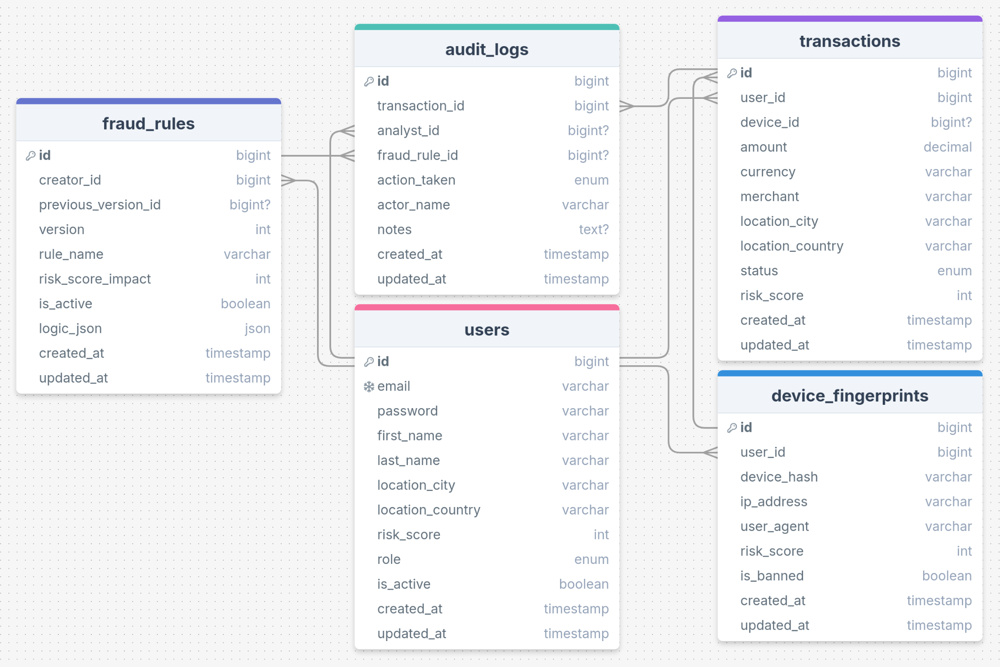

<br/>
<div align="center">
<a href="https://github.com/user/repo">

</a>
<h3 align="center">SentinelStream</h3>
<p align="center">
SentinelStream is a high-velocity fraud detection engine that processes and visualizes banking transactions in real-time
<br/>
<br/>
<a href="https://www.repo.com">View Demo</a> . 
<a href="https://trello.com/b/K5LCVO34/sentinelstream">Trello Board</a> 
</p>
</div>
Table of Contents

- [About The Project](#about-the-project)
  - [DB Schema](#db-schema)
  - [Built With](#built-with)
- [Getting Started](#getting-started)
  - [Prerequisites](#prerequisites)
  - [Installation](#installation)
- [Usage](#usage)
- [Roadmap](#roadmap)
- [Contributing](#contributing)
- [License](#license)
- [Contact](#contact)
- [Acknowledgments](#acknowledgments)
- [Notice](#notice)

## About The Project

SentinelStream is a high-velocity fraud detection engine that processes and visualizes banking transactions in real-time. Built with Node.js and WebSockets, it simulates a live financial network, applying heuristic algorithms to detect anomalies (like velocity attacks) in under 100ms and broadcasting alerts to a live React dashboard.

### DB Schema



### Built With

This project was built with the following technologies:

- 
- 
- 
- 
- 

## Getting Started

Instructions of setting up project on your local machine.

### Prerequisites

Describe prerequisites and how to complete them, this example we're installing nodemon. To install nodemon do the following:

- Install Nodemon:
  ```sh
  npm install -g nodemon
  ```
  Make sure NPM is installed.
- Verify installation:
  ```sh
  nodemon --version
  ```

### Installation

1. **Clone the repository**

   ```sh
   git clone --recurse-submodules https://github.com/venoblin/scripts
   ```

2. **Create settings file (for [ezdownloadsorter](https://github.com/venoblin/download-file-sorter))**

   ```sh
   cd scripts
   touch settings.json
   ```

3. **Modify `settings.json`**

   ```json
   {
     "downloads": "/path/to/Downloads",
     "destinations": {
       ".file-extension": "/path/to/destination",
       ".file-extension": "/path/to/destination",
       ".file-extension": "/path/to/destination"
     }
   }
   ```

4. **Install scripts**
   ```sh
   ./install.sh
   ```

## Usage

Put usage examples here

## Roadmap

The roadmap includes both completed and future goals. Here's what we have accomplished and looking forward to:

- [x] new feature
- [x] new feature
- [x] new feature
  - [x] feature of the new feature
  - [x] feature of the new feature

See the [open issues](https://github.com/user/repo/issues) for a full list of proposed features (and known issues).

## Contributing

Contributions are what make the open source community such an amazing place to learn, inspire, and create. Any contributions you make are **greatly appreciated**.

If you have a suggestion that would make this better, please fork the repo and create a pull request. You can also simply open an issue with the tag &quot;enhancement&quot;.
Don&#39;t forget to give the project a star! Thanks again!

1. Fork the Project
2. Create your Feature Branch (`git checkout -b feature/AmazingFeature`)
3. Commit your Changes (`git commit -m &#39;Add some AmazingFeature&#39;`)
4. Push to the Branch (`git push origin feature/AmazingFeature`)
5. Open a Pull Request

## License

Distributed under the Mozilla Public License 2.0 License. See [Mozilla Public License 2.0 License](https://github.com/user/repo/LICENSE.md) for more information.

## Contact

If you have any questions or suggestions, feel free to reach out to us:

- Raise an issue on the repository: [GitHub Repository](https://github.com/user/repo)
- Connect with us on social media: [@user](https://socialmedia.com/user)

## Acknowledgments

A special thanks to the following for their contributions, support and inspiration:

- [makeread.me](https://github.com/ShaanCoding/makeread.me)
- [Othneil Drew](https://github.com/othneildrew/Best-README-Template)

## Notice

Any other information.
