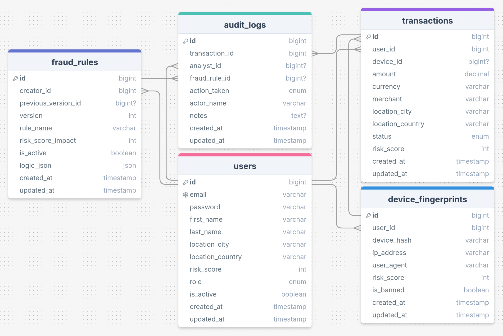

 

<h3 align="center">SentinelStream</h3>

SentinelStream is a high-velocity fraud detection engine that processes and visualizes banking transactions in real-time
 
 
<a href="#">View Demo</a> . 
<a href="https://trello.com/b/K5LCVO34/sentinelstream">Trello Board</a> 

Table of Contents

- [About The Project](#about-the-project)
  - [Database Schema](#database-schema)
  - [Built With](#built-with)

## About The Project

SentinelStream is a high-velocity fraud detection engine that processes and visualizes banking transactions in real-time. Built with Node.js and WebSockets, it simulates a live financial network, applying heuristic algorithms to detect anomalies (like velocity attacks) in under 100ms and broadcasting alerts to a live React dashboard.

### Database Schema

The schema enforces strict Separation of Duties (SoD) by isolating internal Staff/Analysts from Customer entities, ensuring operational security and preventing insider threat transaction.

### Built With

This project was built with the following technologies:

- 
- 
- 
- 
- 
